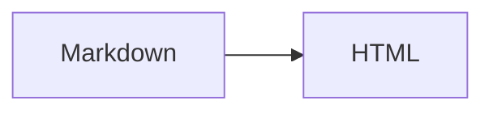

# Official plugins

A Markdown plugin is a build-time transform added to the content compiler. It receives one Markdown or MDX syntax tree and returns transformed syntax or HTML. A plugin can also declare the CSS and browser scripts required by that page. The deployed result remains static HTML; the plugin itself does not run in production.

For example, `math()` turns `$E = mc^2$` into KaTeX HTML during the build. `mermaid()` loads its diagram client only on pages that contain executable Mermaid fences. A search provider has a different lifecycle: it receives the completed site and writes a site-wide index instead of transforming one document.

Official plugins are published in `@canofold/plugins`:

:::code-group[Package manager]

```bash title="pnpm"
pnpm add -D @canofold/plugins
```

```bash title="npm"
npm install --save-dev @canofold/plugins
```

```bash title="yarn"
yarn add --dev @canofold/plugins
```

:::

## Available capabilities

| Factory | Configuration | Purpose | Extra requirement |
|---|---|---|---|
| `externalLinks()` | `markdown.plugins` | Add safe attributes to external links | None |
| `linkCard()` | `markdown.plugins` | Render a standalone link as a card | None |
| `readingTime()` | `markdown.plugins` | Show reading time below the title | None |
| `math()` | `markdown.plugins` | Render mathematical notation | Import `@canofold/plugins/math.css` when using the Markdown package directly |
| `mermaid()` | `markdown.plugins` | Render Mermaid diagrams | Install `mermaid` |
| `plantUml()` | `markdown.plugins` | Render PlantUML diagrams | Configure a trusted `server` |
| `kroki()` | `markdown.plugins` | Render Graphviz and D2 through Kroki | Uses `https://kroki.io` by default; self-hosting is supported |
| `pagefind()` | `search.provider` | Build a Pagefind search index | Install `pagefind` |

## Configure and use plugins

These packages run during local development and site builds, so install them as development dependencies. Add only the capabilities the site needs; when enabling Mermaid or Pagefind, install the corresponding dependency as well:

```bash
pnpm add -D mermaid pagefind
```

```ts title="canofold.config.ts"
import { externalLinks, math, mermaid, pagefind } from '@canofold/plugins'
import { defineConfig } from 'canofold'

export default defineConfig({
  search: {
    provider: pagefind()
  },
  markdown: {
    plugins: [
      math(),
      mermaid(),
      externalLinks({ internalHosts: ['docs.example.com'] })
    ]
  }
})
```

`readingTime()` includes English and Chinese labels. Pass `labels` only when adding another locale or changing the wording.

After configuration, write the syntax owned by the plugins:

````markdown
Inline math $E = mc^2$.


````

`canofold check` loads the config and uses plugin declarations to validate directives and code fences; it does not render complete pages. `canofold build` and `canofold dev` execute plugin transforms. Removing a plugin stops its syntax from being transformed, and fences not claimed by another plugin remain subject to the unknown-language policy.

## Run and verify

```bash
pnpm docs:check
pnpm docs:dev
```

Open the page containing the sample syntax. The formula should be typeset, and Mermaid should display a diagram instead of source. External links should have the configured `target` and `rel` attributes.

Check production output before publishing:

```bash
pnpm docs:build
pnpm docs:preview
```

Search for the page in the preview and confirm that Pagefind returns it. Ordinary pages should not load the Mermaid client; the client is added only to pages with executable Mermaid fences. If a plugin has no effect, see [Troubleshooting](/en/reference/output/troubleshooting/#a-plugin-has-no-effect).

## Option reference

Every option is optional. The table lists the behavior used when an option is omitted:

| Factory | Option | Default | Effect |
|---|---|---|---|
| `externalLinks` | `newTab` | `true` | Open external links in a new window |
|  | `rel` | `['noopener', 'noreferrer']` | Values written to external-link `rel` |
|  | `internalHosts` | `[]` | Hosts and subdomains treated as internal |
| `linkCard` | `internalHosts` | `[]` | Hosts that are not converted to external cards |
|  | `includeRelative` | `false` | Also convert site links beginning with `/` |
| `readingTime` | `wordsPerMinute` | `220` | Latin words per minute; must be positive and finite |
|  | `cjkWordsPerMinute` | `300` | CJK characters per minute; must be positive and finite |
|  | `includeCode` | `false` | Include code in the estimate |
|  | `label` | `'{minutes} min read'` | Fallback template when no locale label matches |
|  | `labels` | Built-in Chinese | Override templates by locale while retaining `{minutes}` |
| `math` | `throwOnError` | `false` | Throw when KaTeX encounters invalid input |
|  | `errorColor` | `'#b42318'` | Error color when errors are rendered |
|  | `trust` | `false` | Allow trusted KaTeX commands that emit URLs or HTML |
|  | `strict` | `'warn'` | KaTeX strictness policy |
|  | `macros` | `{}` | Custom KaTeX macros |
| `mermaid` | `moduleUrl` | Bundled resource | Override the browser Mermaid ESM URL |
| `plantUml` | `server` | `false` | PlantUML server; source-only output when omitted |
| `kroki` | `server` | `https://kroki.io` | Kroki service URL |
|  | `languages` | Graphviz, Dot, GV, D2 | Markdown language to Kroki type mapping |
|  | `format` | `'svg'` | Emit `svg` or `png` |
| `pagefind` | `includeCharacters` | `'._-'` | Characters retained during Pagefind tokenization |
|  | `keepIndexUrl` | `false` | Preserve index-page URLs |
|  | `writePlayground` | `false` | Generate Pagefind's debugging playground |

## Plugins, providers, and extensions

| Type | Use it for | Configuration |
|---|---|---|
| Markdown plugin | Syntax or HTML transformation within one document | `markdown.plugins` |
| Search provider | An index generated from the complete site | `search.provider` |
| Extension | Repository source transforms, page metadata, or extra files | `extensions` |

The package manager installs the complete `@canofold/plugins` package. Only plugins passed to the config process content and affect build output. Capabilities with browser runtimes also load assets per page. Only an executable Mermaid fence activates Mermaid; a Mermaid example shown inside a tutorial code block does not load the runtime.

Use the package root in normal site config. Capability subpaths remain public APIs for libraries and tools that resolve one focused entry.

## Build a minimal plugin

A custom plugin can live in the project and be imported by `canofold.config.ts`. This complete example adds a project-owned `data-section` attribute to every level-two heading without relying on internal Canofold classes:

```js title="markdown/section-labels.mjs"
import { defineMarkdownPlugin } from '@canofold/markdown'

function markSections() {
  return (tree) => {
    const walk = (node) => {
      if (node.type === 'element' && node.tagName === 'h2') {
        node.properties ??= {}
        node.properties.dataSection = ''
      }
      node.children?.forEach(walk)
    }
    walk(tree)
  }
}

export function sectionLabels() {
  return defineMarkdownPlugin({
    name: 'section-labels',
    version: '1',
    rehypePlugins: [markSections]
  })
}
```

```ts title="canofold.config.ts"
import { defineConfig } from 'canofold'
import { sectionLabels } from './markdown/section-labels.mjs'

export default defineConfig({
  markdown: { plugins: [sectionLabels()] },
  styles: ['./docs/section-labels.css']
})
```

```css title="docs/section-labels.css"
h2[data-section] {
  border-inline-start: 0.2rem solid currentColor;
  padding-inline-start: 0.75rem;
}
```

Run `pnpm docs:dev` and verify that level-two headings have a leading rule. Then run `pnpm docs:build` and confirm that generated level-two headings have a `data-section` attribute. The first result verifies the project CSS; the second verifies the plugin transform.

`name` is unique within one compiler. Bump `version` when transform behavior changes and put resolved options in `cacheKey`. A plugin that owns custom directives or code fences must also declare `directiveNames` or `fenceLanguages`, so typo and unknown-language checks can distinguish valid plugin syntax.
