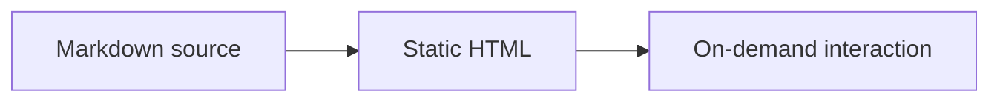
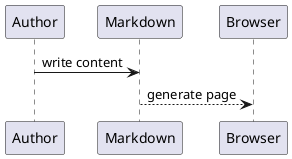
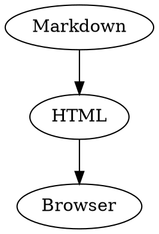

# Markdown Playground

Edit the source on the left and the rendered output updates on the right. Desktop panes use a draggable divider and synchronized scrolling; on narrow screens, use the upper-right icon to switch views. See [Use the Markdown package](/en/markdown/usage/) for integration.

## Headings and prose

### Third-level heading

#### Fourth-level heading

##### Fifth-level heading

###### Sixth-level heading

## Inline semantics

Body text supports **strong**, _emphasis_, ~~deletion~~, <mark>highlight</mark>, `inline code`, <kbd>Ctrl</kbd> + <kbd>K</kbd>, H<sub>2</sub>O, E=mc<sup>2</sup>, <abbr title="Application Programming Interface" tabindex="0">API</abbr>, <cite>citations</cite>, <q>short quotes</q>, <small>secondary detail</small>, <var>variables</var>, <samp>output</samp>, and <time datetime="2026-08-12">August 12, 2026</time>.

Statuses use :badge[Default], :badge[Beta]{tone="accent"}, :badge[Released]{tone="success"}, :badge[Review]{tone="warning"}, and :badge[Risk]{tone="danger"}.

[A normal link](/en/guide/introduction/getting-started/) and an autolink <https://docfuse.dev> keep the same visual and keyboard contract.

---

## Lists, tasks, and definitions

- An unordered item.
  - A nested item preserves structure.
- Another item.

1. A first ordered step.
2. A second ordered step.

- [x] Semantic HTML is generated.
- [x] Interaction loads on demand.
- [ ] A host may apply brand tokens.

Default behavior
: The compiler generates semantic HTML with keyboard handling, focus states, and ARIA.

Customizable behavior
: Colors, typography, spacing, radii, labels, and component replacements.

## Quotes and callouts

> A documentation UI should clarify content without competing with it.

:::info Context
Use neutral information that does not interrupt the main task.
:::

:::tip Recommendation
Offer a concrete action that reduces effort or risk.
:::

:::warning Check first
Describe a condition that may make the operation fail.
:::

:::danger Irreversible action
Reserve danger for security, data loss, or destructive operations.
:::

## Code and terminal

Copy a short command directly: :copy[pnpm add @docfuse/markdown].

```ts title="docfuse.config.ts"
export default {
  title: 'Docfuse',
  search: { enabled: true }
}
```

### Highlight selected lines

Fence metadata can combine a filename with one or more highlighted lines:

```ts title="docfuse.config.ts" {2,4-5}
export default {
  title: 'Docfuse',
  i18n: { defaultLocale: 'en', locales: ['en'] },
  search: { enabled: true },
  theme: { darkMode: true }
}
```

### Annotate line states

Line markers demonstrate highlight, diff, focus, word, error, and warning states without changing the block anatomy:

```ts
const oldName = 'docs' // [!code --]
const newName = 'docfuse' // [!code ++]
const searchable = true // [!code highlight]
const result = buildSite(config) // [!code focus]
const output = resolveOutput(config) // [!code word:resolveOutput]
throw new Error('Invalid config') // [!code error]
console.warn('Missing description') // [!code warning]
```

### Multiple languages

Built-in languages reuse the same file bar, line numbers, copy feedback, light/dark theme, and wrapping:

```bash
pnpm docs:build
pnpm docs:preview
```

```json
{
  "title": "Docfuse",
  "search": { "enabled": true }
}
```

### Project files and source

The code-block title selects the filename and file icon; the fence language selects highlighting.

:::code-group[Project files]

```json title="package.json"
{ "scripts": { "docs:dev": "docfuse dev" } }
```

```ts title="docfuse.config.ts"
import { defineConfig } from 'docfuse'
export default defineConfig({ title: 'Docfuse' })
```

```markdown title="README.md"
# Docfuse
Build and publish the documentation site.
```

```yaml title=".github/workflows/docs.yml"
steps:
  - run: pnpm docs:build
```

:::

:::code-group[Components and source]

```tsx title="SearchPanel.tsx"
export function SearchPanel() {
  return <button type="button">Search</button>
}
```

```mdx title="status.mdx"
import { Status } from './Status'
<Status value="stable" />
```

```vue title="StatusBadge.vue"
<template><span>{{ status }}</span></template>
```

```python title="build.py"
print('build complete')
```

```rust title="main.rs"
fn main() { println!("build complete"); }
```

:::

:::code-group[Configuration and delivery]

```dotenv title=".env.example"
DOCFUSE_ORIGIN=https://docs.example.com
```

```scss title="theme.scss"
$accent: #0071e3;
.docs { color: $accent; }
```

```sql title="schema.sql"
create table documents (id integer primary key, slug text not null);
```

```dockerfile title="Dockerfile"
FROM nginx:alpine
COPY .docfuse/dist /usr/share/nginx/html
```

```nginx title="docs.conf"
location / { try_files $uri $uri/ =404; }
```

```diff title="navigation.diff"
- const locale = 'zh'
+ const locale = 'en'
```

:::

Long lines wrap inside the code block instead of widening the content canvas:

```ts title="long-line.ts"
const summary = 'Docfuse keeps Markdown, MDX, React components, search, localization, versioning, static output, and machine-readable artifacts in one build workflow.'
```

### Code Group

:::code-group[Package manager]

```bash title="pnpm"
pnpm add @docfuse/markdown
```

```bash title="npm"
npm install @docfuse/markdown
```

```bash title="yarn"
yarn add @docfuse/markdown
```

:::

### Terminal

```terminal title="Terminal"
$ pnpm docs:build
✓ Built 42 pages in 1.8s
```

Failure output keeps the command, source location, and exit state together:

```terminal title="Build failed"
$ pnpm exec docfuse check
✗ docs/guide/setup.md: broken internal link /guide/install/
Command failed with exit code 1
```

## Tables and data

| Element | Default presentation | Interaction |
|---|---|---|
| Heading | Stable hierarchy and anchor | Copy section link |
| Code block | Shiki highlight and label | Copy source |
| Table | Semantic header and rows | Sort, copy/download CSV, enlarge |
| Diagram | Preview and source | Copy, switch, zoom |
| Image | Responsive media frame | Open large preview |

Use the table header to test sorting and the toolbar to test CSV and preview behavior.

## Extended content components

### Tabs

::::tabs[Installation]
:::tab[Quick]
Use the default theme and component map.
:::
:::tab[Customized]
Provide semantic component overrides and theme tokens.
:::
:::tab[Continuous integration]
Run `pnpm typecheck` before merge and `pnpm docs:build` before publishing.
:::
::::

### Steps

::::steps[Release flow]
:::step[Prepare content]
Write Markdown, complete frontmatter, and verify local asset paths.
:::
:::step[Verify]
Run content checks and a clean production build.
:::
:::step[Publish]
Upload the generated static directory.
:::
::::

### Card Grid

::::card-grid
:::card[Package usage]{href="/en/markdown/usage/"}
React, SSR, static enhancement, and themes.
:::
:::card[React API]{href="/en/reference/api/react-markdown/"}
Exact props, types, and public entries.
:::
::::

### Link Card

With `linkCard()` enabled, a standalone HTTP(S) link becomes a link card:

[Docfuse on GitHub](https://github.com/jiangxinlei/docfuse)

### File Tree

:::file-tree
- docs/
  - en/
    - playground.md
    - usage.md
  - zh/
    - playground.md
    - usage.md
- public/
  - logo.svg
- docfuse.config.ts
- package.json
:::

## API block and aside

::::api{method="GET" path="/api/docs/:slug"}
| Parameter | Type | Required | Description |
|---|---|---|---|
| `slug` | :badge[string] | :badge[yes]{tone="danger"} | Document route identifier |
| `locale` | :badge[string] | :badge[no] | Falls back to the site's default locale |
| `draft` | :badge[boolean] | :badge[no] | Allows draft content when explicitly enabled |

:::response[200]
`{ "title": "Markdown" }`
:::
:::response[404]
`{ "error": "Not found" }`
:::
::::

:::aside[Aside]
API timestamps use UTC. Convert them to the reader's time zone before display.
:::

## Files, images, and trusted media

### PDF, Word, PowerPoint, and Excel

Standalone links with supported document extensions become file blocks. The URLs below only demonstrate the file-block appearance; replace them with real file URLs in your site:

[Docfuse API reference](https://assets.example.com/docfuse-api.pdf)

[Release checklist](https://assets.example.com/release-checklist.docx)

[Product demo](https://assets.example.com/product-demo.pptx)

[Compatibility matrix](https://assets.example.com/compatibility.xlsx)

### Images and captions


### Gallery

:::gallery[Image gallery]


:::

### Video, audio, and embeds

::video[Flower video demo]{src="https://interactive-examples.mdn.mozilla.net/media/cc0-videos/flower.mp4" poster="/examples/editor-preview-photo.jpg"}

::audio[Tyrannosaurus sound demo]{src="https://interactive-examples.mdn.mozilla.net/media/cc0-audio/t-rex-roar.mp3"}

::embed[Docfuse introduction]{src="/en/guide/introduction/what-is-docfuse/"}

These directives generate native media elements and apply accessible labels, loading defaults, and iframe permission boundaries.

Put media files in `docs/public/` and reference them with site-absolute paths.

## Diagrams and math

Enable Mermaid, PlantUML, Kroki, and math through [official plugins](/en/guide/site/plugins/). Each diagram supports source copy, source/preview switching, inline zoom, and an expanded view.







```d2
Markdown -> Docfuse: render
Docfuse -> Browser: static HTML
```

Inline math $E = mc^2$ follows prose. Display math owns its overflow boundary:

$$
\int_{0}^{1} x^2 \, dx = \frac{1}{3}
$$

## Details and footnotes

:::details[Expanded details]{open}
Native disclosure keeps keyboard and focus behavior without a mandatory rich runtime.
:::

:::details[When should content be collapsed?]
Use a disclosure for optional steps, long logs, or compatibility notes. Keep information required for the current task in the main flow.
:::

Footnotes add a source or short explanation without interrupting the main flow.[^footnote]

[^footnote]: Follow the footnote number to the note, then use the return link to continue reading.

Use [Package usage](/en/markdown/usage/) for integration and the [React API](/en/reference/api/react-markdown/) for exact contracts.
