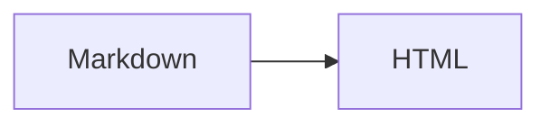

# Markdown syntax reference

Docfuse supports CommonMark, GFM, and a small directive grammar for technical documentation. Use standard Markdown for prose and Docfuse directives for structured content such as tabs, steps, and file trees. The compiler owns the HTML, ARIA, and interaction attributes, so documents do not need `df-*` class names.

## Standard Markdown and GFM

| Content | Syntax |
|---|---|
| Headings | `#` through `######` |
| Emphasis | `**bold**`, `_italic_`, `~~deleted~~` |
| Links and images | `[text](url)`, `` |
| Lists and tasks | `-`, `1.`, `- [x]` |
| Quotes | `> quoted text` |
| Code | `` `inline` `` and fenced code blocks |
| Tables | GFM pipe tables |
| Footnotes | `[^name]` and `[^name]: content` |
| Definition lists | A term followed by a line that starts with `:` |

An image title becomes its caption. A standalone PDF, Word, PowerPoint, or Excel link becomes a file block.

```markdown
Footnote reference.[^source]

[^source]: Footnotes are collected at the end of the page with a backlink.
```

## Code block titles and annotations

Add `title`, `filename`, `label`, or `[filename]` after the fence to label a code block. Use `{2,4-5}` to highlight selected lines.

````markdown
```ts title="docfuse.config.ts" {2}
import { defineConfig } from 'docfuse'
export default defineConfig({ title: 'Docs' })
```

```ts [routes.ts]
export const routes = []
```
````

Use Shiki annotations in code comments when a sample needs to explain a change or problem line. Annotations affect presentation and are omitted from copied code.

| Annotation | Result |
|---|---|
| `[!code ++]`, `[!code --]` | Added and removed lines |
| `[!code highlight]` | Highlight the current line |
| `[!code focus]` | Focus the current line and dim the rest |
| `[!code word:name]` | Highlight matching text |
| `[!code error]`, `[!code warning]` | Error and warning lines |

````markdown
```ts
const oldName = 'docs' // [!code --]
const newName = 'docfuse' // [!code ++]
const result = buildSite(config) // [!code focus]
const output = resolveOutput(config) // [!code word:resolveOutput]
throw new Error('Invalid config') // [!code error]
console.warn('Missing description') // [!code warning]
```
````

## Callouts

Use an `info`, `tip`, `warning`, or `danger` container. The title is optional.

```markdown
:::tip[Before committing]
Run the type check and production build.
:::
```

The friendly form `:::tip Before committing` is normalized to the same structure.

## Tabs and code groups

Tabs may contain only direct `tab` children. Missing labels use localized defaults.

```markdown
::::tabs[Install]
:::tab[pnpm]
Run `pnpm add -D docfuse`.
:::
:::tab[npm]
Run `npm install --save-dev docfuse`.
:::
::::
```

A code group may contain only fenced code blocks. `title` or `filename` becomes the tab label.

````markdown
:::code-group[Package manager]
```bash title="pnpm"
pnpm add -D docfuse
```
```bash title="npm"
npm install --save-dev docfuse
```
:::
````

## Steps and terminal output

Steps may contain only direct `step` children:

```markdown
::::steps[Release]
:::step[Build]
Run `pnpm build`.
:::
:::step[Publish]
Upload `.docfuse/dist`.
:::
::::
```

Use a `terminal` fence for shell output and an optional `title` for its toolbar label:

````markdown
```terminal title="Build"
$ pnpm build
✓ Built 42 pages
```
````

## File tree

`file-tree` requires a Markdown list. Entries ending in `/` are directories.

```markdown
:::file-tree
- docs/
  - guide/
    - index.md
- docfuse.config.ts
:::
```

## Cards

`card-grid` may contain only direct `card` children. Every card requires `href`.

```markdown
::::card-grid
:::card[Get started]{href="/en/guide/"}
Install Docfuse and build the first site.
:::
:::card[Configuration]{href="/en/reference/configuration/"}
Look up every configuration field.
:::
::::
```

## API blocks

`api` requires both `method` and `path`. A `response` must be its direct child and have a status label.

```markdown
::::api{method="GET" path="/api/docs/:slug"}
| Parameter | Type |
|---|---|
| `slug` | :badge[string] |

:::response[200]
`{ "title": "Docfuse" }`
:::
::::
```

## Inline and supporting content

```markdown
:::aside[Implementation note]
Put supporting detail here without interrupting the main flow.
:::

Status: :badge[Beta]{tone="accent"}

Command: :copy[pnpm add @docfuse/markdown]
```

Badge `tone` accepts `accent`, `success`, `warning`, or `danger`. `:copy` requires text to copy.

## Image gallery

Each Gallery item must be its own paragraph and contain exactly one Markdown image. An image title becomes its caption.

```markdown
:::gallery[Interface]


:::
```

## Disclosure

The `details` label becomes a native `<summary>`. Its body accepts Markdown. Add `open` to expand it initially.

```markdown
:::details[Deployment checks]{open}
- Check internal links.
- Run the production build.
:::
```

## Audio, video, and embeds

Media uses leaf directives instead of handwritten HTML. All three directives require `src` and an accessible label.

```markdown
::video[Product demo]{src="/media/demo.mp4" poster="/media/poster.jpg" preload="metadata"}

::audio[Release notes]{src="/media/release.mp3" preload="none"}

::embed[Getting started]{src="/en/guide/" allowfullscreen}
```

| Directive | Optional attributes | Defaults |
|---|---|---|
| `video` | `poster`, `preload` | `preload="metadata"` |
| `audio` | `preload` | `preload="none"` |
| `embed` | `loading`, `sandbox`, `allow`, `referrerpolicy`, `allowfullscreen` | `loading="lazy"`, empty `sandbox`, `referrerpolicy="no-referrer"` |

`src` and `poster` accept relative, HTTP, or HTTPS URLs. `preload` accepts `none`, `metadata`, or `auto`; `loading` accepts `lazy` or `eager`. When an iframe needs more permissions, set the smallest explicit `sandbox` and `allow` values that work.

## Plugin syntax

Math, Mermaid, PlantUML, Graphviz, and D2 are enabled by [official plugins](/en/guide/site/plugins/). Syntax is transformed and resources are loaded only when the matching plugin is configured.

````markdown


Inline math $E = mc^2$.
````

## HTML and validation

Native HTML remains an escape hatch for trusted content. A site chooses `trusted`, `sanitize`, or `strip` through `markdown.html`; standalone `<Markdown>` rendering defaults to `strip`.

Docfuse validates directive names, form, required attributes, and nesting. Invalid syntax stops rendering, and `docfuse check` reports the file and source position. A custom plugin must declare its directives through `directiveNames`; undeclared names are treated as authoring errors.

Open the [Playground](/en/markdown/playground/) to inspect each rendered element.
