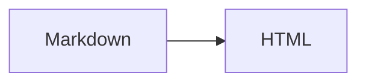

# 官方插件

Markdown 插件是在构建期加入内容编译器的转换步骤。它接收一篇 Markdown 或 MDX 的语法树，返回新的语法树或 HTML；插件还可以声明当前页面需要的 CSS 和浏览器脚本。最终产物仍是静态 HTML，不需要在生产环境运行插件本身。

例如，配置 `math()` 后，源码中的 `$E = mc^2$` 会在构建时变成 KaTeX HTML；配置 `mermaid()` 后，只有包含 Mermaid 围栏的页面才会加载图表客户端。搜索 Provider 不处理单篇 Markdown，而是在全部页面完成后生成站点级索引。

官方插件统一发布在 `@docfuse/plugins`：

:::code-group[包管理器]

```bash title="pnpm"
pnpm add -D @docfuse/plugins
```

```bash title="npm"
npm install --save-dev @docfuse/plugins
```

```bash title="yarn"
yarn add --dev @docfuse/plugins
```

:::

## 可用能力

| 工厂 | 配置位置 | 作用 | 额外要求 |
|---|---|---|---|
| `externalLinks()` | `markdown.plugins` | 为外链添加安全属性 | 无 |
| `linkCard()` | `markdown.plugins` | 把独占段落的链接渲染为卡片 | 无 |
| `readingTime()` | `markdown.plugins` | 在标题后显示阅读时长 | 无 |
| `math()` | `markdown.plugins` | 渲染数学公式 | 独立使用 Markdown 包时导入 `@docfuse/plugins/math.css` |
| `mermaid()` | `markdown.plugins` | 渲染 Mermaid 图表 | 安装 `mermaid` |
| `plantUml()` | `markdown.plugins` | 渲染 PlantUML 图表 | 配置可信的 `server` |
| `kroki()` | `markdown.plugins` | 通过 Kroki 渲染 Graphviz 和 D2 | 默认使用 `https://kroki.io`，也可自托管 |
| `pagefind()` | `search.provider` | 生成 Pagefind 搜索索引 | 安装 `pagefind` |

## 配置并使用插件

这些包只在本地开发和站点构建时使用，因此安装为开发依赖。只安装并配置站点需要的能力；启用 Mermaid 或 Pagefind 时，再补充对应依赖：

```bash
pnpm add -D mermaid pagefind
```

```ts title="docfuse.config.ts"
import { externalLinks, math, mermaid, pagefind } from '@docfuse/plugins'
import { defineConfig } from 'docfuse'

export default defineConfig({
  search: {
    provider: pagefind()
  },
  markdown: {
    plugins: [
      math(),
      mermaid(),
      externalLinks({ internalHosts: ['docs.example.com'] })
    ]
  }
})
```

`readingTime()` 已内置中英文文案。只有新增语言或需要改写文案时才传 `labels`。

配置完成后直接使用插件拥有的 Markdown 语法：

````markdown
行内公式 $E = mc^2$。


````

`docfuse check` 会加载配置，并根据插件声明校验指令和代码围栏；它不会执行完整的页面渲染。`docfuse build` 和 `docfuse dev` 才会执行插件转换。删除配置后，对应语法不再转换，未被其他插件声明的围栏仍受未知语言策略检查。

## 运行并验证

```bash
pnpm docs:check
pnpm docs:dev
```

打开包含示例语法的页面，确认公式已经排版、Mermaid 显示图表而不是源码。外链应按配置带有 `target` 和 `rel` 属性。

发布前再检查生产产物：

```bash
pnpm docs:build
pnpm docs:preview
```

在预览中搜索该页面，确认 Pagefind 返回结果。普通页面不应加载 Mermaid 客户端；只有包含可执行 Mermaid 围栏的页面才会加载它。插件没有生效时，按[故障排查](/reference/output/troubleshooting/#插件没有生效)检查。

## 选项参考

所有选项都可省略。数值和行为均使用下表中的默认值：

| 工厂 | 选项 | 默认值 | 作用 |
|---|---|---|---|
| `externalLinks` | `newTab` | `true` | 外链使用新窗口 |
|  | `rel` | `['noopener', 'noreferrer']` | 写入外链的 `rel` |
|  | `internalHosts` | `[]` | 视为站内链接的域名及其子域名 |
| `linkCard` | `internalHosts` | `[]` | 不转换为外链卡片的域名 |
|  | `includeRelative` | `false` | 同时转换以 `/` 开头的站内链接 |
| `readingTime` | `wordsPerMinute` | `220` | 拉丁文本每分钟词数，必须是正有限数 |
|  | `cjkWordsPerMinute` | `300` | 中日韩文本每分钟字符数，必须是正有限数 |
|  | `includeCode` | `false` | 是否把代码计入阅读时长 |
|  | `label` | `'{minutes} min read'` | 未匹配语言时的文案 |
|  | `labels` | 内置中文 | 按 locale 覆盖文案，保留 `{minutes}` 占位符 |
| `math` | `throwOnError` | `false` | KaTeX 遇到错误时是否抛出异常 |
|  | `errorColor` | `'#b42318'` | 非抛错模式下的错误颜色 |
|  | `trust` | `false` | 是否允许 KaTeX 生成 URL 或 HTML 的受信命令 |
|  | `strict` | `'warn'` | KaTeX 严格模式 |
|  | `macros` | `{}` | 自定义 KaTeX 宏 |
| `mermaid` | `moduleUrl` | 内置资源 | 覆盖浏览器端 Mermaid ESM 地址 |
| `plantUml` | `server` | `false` | PlantUML 服务地址；未配置时只展示源码 |
| `kroki` | `server` | `https://kroki.io` | Kroki 服务地址 |
|  | `languages` | Graphviz、Dot、GV、D2 | Markdown 语言名到 Kroki 类型的映射 |
|  | `format` | `'svg'` | 输出 `svg` 或 `png` |
| `pagefind` | `includeCharacters` | `'._-'` | Pagefind 分词时保留的字符 |
|  | `keepIndexUrl` | `false` | 是否保留索引页 URL |
|  | `writePlayground` | `false` | 是否生成 Pagefind 调试 Playground |

## 插件、Provider 和 Extension

| 类型 | 适合解决的问题 | 配置位置 |
|---|---|---|
| Markdown 插件 | 一篇文档中的语法或 HTML 转换 | `markdown.plugins` |
| Search Provider | 根据整个站点生成搜索索引 | `search.provider` |
| Extension | 转换仓库源码、补充页面元数据或生成附加文件 | `extensions` |

包管理器会安装整个 `@docfuse/plugins` 包；只有传入配置的插件会参与内容处理并影响构建结果。需要浏览器运行时的能力还会按页面内容加载资源；只有可执行的 Mermaid 围栏会启用 Mermaid，教程代码块里展示的 Mermaid 示例不会误加载运行时。

常规配置使用包根入口。子路径入口仍是公共 API，适合只解析单项能力的库或工具。

## 编写一个最小插件

自定义插件可以放在项目中，再从 `docfuse.config.ts` 导入。下面的完整示例为所有二级标题添加项目自己的 `data-section` 属性，不依赖 Docfuse 内部 class：

```js title="markdown/section-labels.mjs"
import { defineMarkdownPlugin } from '@docfuse/markdown'

function markSections() {
  return (tree) => {
    const walk = (node) => {
      if (node.type === 'element' && node.tagName === 'h2') {
        node.properties ??= {}
        node.properties.dataSection = ''
      }
      node.children?.forEach(walk)
    }
    walk(tree)
  }
}

export function sectionLabels() {
  return defineMarkdownPlugin({
    name: 'section-labels',
    version: '1',
    rehypePlugins: [markSections]
  })
}
```

```ts title="docfuse.config.ts"
import { defineConfig } from 'docfuse'
import { sectionLabels } from './markdown/section-labels.mjs'

export default defineConfig({
  markdown: { plugins: [sectionLabels()] },
  styles: ['./docs/section-labels.css']
})
```

```css title="docs/section-labels.css"
h2[data-section] {
  border-inline-start: 0.2rem solid currentColor;
  padding-inline-start: 0.75rem;
}
```

运行 `pnpm docs:dev` 后，二级标题左侧应出现边线。再运行 `pnpm docs:build`，确认生成的二级标题带有 `data-section` 属性。前者验证项目 CSS，后者验证插件转换。

`name` 是同一编译器中的唯一标识；转换行为变化时要提升 `version`，配置数据放进 `cacheKey`。插件如果拥有自定义指令或代码围栏，还要分别声明 `directiveNames` 或 `fenceLanguages`，否则拼写错误和未知语言检查无法区分这些语法。
