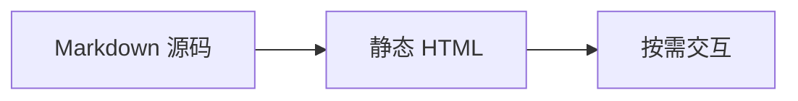
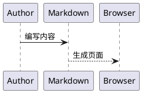
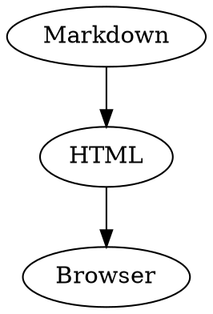

# Markdown Playground

编辑左侧源码，右侧会实时更新渲染结果。桌面端可以拖动分隔线并同步滚动，窄屏使用右上角图标切换源码和预览。接入方式见[使用 Markdown 包](/markdown/usage/)。

## 标题与正文

### H3 / 三级标题

#### H4 / 四级标题

##### H5 / 五级标题

###### H6 / 六级标题

`h2-h6` 会生成章节锚点。正文可以同时包含中文、English words、数字 `2026` 和 `inline code`。

## 行内语义

普通文本可以包含 **加粗 strong**、_斜体 emphasis_、~~删除线~~、<mark>高亮 mark</mark>、`inline code`、<kbd>⌘</kbd> + <kbd>K</kbd>、H<sub>2</sub>O、E=mc<sup>2</sup>、<abbr title="Application Programming Interface" tabindex="0">API</abbr>、<cite>引用来源</cite>、<q>行内短引用</q>、<small>次要补充</small>、变量 <var>config</var>、输出 <samp>build complete</samp>、emoji ✨ 和 <time datetime="2026-07-14">2026 年 7 月 14 日</time>。

状态可以使用 :badge[默认]、:badge[Beta]{tone="accent"}、:badge[已发布]{tone="success"}、:badge[待确认]{tone="warning"} 和 :badge[有风险]{tone="danger"}。

[普通链接](/guide/introduction/getting-started/) 保留下划线和清晰的 hover 状态；自动链接也遵循相同规则：https://canofold.dev 。

[引用式链接][guide] 与普通链接使用同一视觉规则。反斜杠转义后的 \*星号\* 保持为文字，HTML 实体 `&copy;` 解码为 &copy;。这一行末尾改用显式 `<br />`，<br />
因此这里是一个明确的 `br` 硬换行。

[guide]: /guide/introduction/getting-started/ '快速开始'

---

## 列表与任务

- 无序列表用于并列信息。
  - 嵌套列表保持明确缩进。

1. 有序列表表达顺序。
2. 数字 marker 与正文对齐。
3. 多行内容仍保持可读缩进。

- [x] 语义 HTML 在构建期生成
- [x] 搜索、复制、排序和放大按需增强
- [ ] 宿主项目接入自己的品牌 token

默认行为
: 编译器生成语义 HTML，并补齐键盘操作、ARIA 和焦点状态。

可调整内容
: 颜色、字体、圆角、代码主题、功能开关和本地化文案。

## 引用与提示

> 好的文档界面不应抢走内容的注意力。结构来自排版、空间和克制的状态反馈，而不是密集边框。

:::info 说明
用于补充上下文，语气保持中性。
:::

:::tip 建议
提供可以直接执行的下一步。
:::

:::warning 注意
说明可能导致操作失败的条件。
:::

:::danger 危险
只用于安全风险、数据丢失或不可逆操作。
:::

## 代码与终端

行内代码适合短标识符，例如 `CanofoldConfig`。需要直接复制的短命令使用 :copy[pnpm add @canofold/markdown]。代码块使用 Shiki 高亮、语言标签、行号、复制按钮；长行自动换行，不出现横向滚动条。

```ts title="canofold.config.ts"
export default {
  title: 'Canofold',
  i18n: { defaultLocale: 'zh', locales: ['zh'] },
  search: { enabled: true }
}
```

### 指定行高亮

代码围栏可以同时声明文件名和一个或多个高亮行，适合把读者注意力落在本次讲解涉及的代码上：

```ts title="canofold.config.ts" {2,4-5}
export default {
  title: 'Canofold',
  i18n: { defaultLocale: 'zh', locales: ['zh'] },
  search: { enabled: true },
  theme: { darkMode: true }
}
```

### 行状态标注

删除和新增行会在行号区显示 `−` 和 `+`：

```ts
const oldName = 'docs' // [!code --]
const newName = 'canofold' // [!code ++]
```

highlight、focus、word、error 和 warning 继续使用同一代码块结构，只改变需要强调的行：

```ts
const searchable = true // [!code highlight]
const result = buildSite(config) // [!code focus]
const output = resolveOutput(config) // [!code word:resolveOutput]
throw new Error('Invalid config') // [!code error]
console.warn('Missing description') // [!code warning]
```

### 多语言高亮

内置语言会复用相同的文件栏、行号、复制反馈、亮暗主题和自动换行：

```bash
pnpm docs:build
pnpm docs:preview
```

```json
{
  "title": "Canofold",
  "search": { "enabled": true },
  "theme": { "baseColor": "paper" }
}
```

### 项目文件与源码

代码块标题决定文件名和文件图标；语言决定高亮器。下面几组覆盖常见项目文件、组件源码和交付配置。

:::code-group[项目文件]

```json title="package.json"
{ "scripts": { "docs:dev": "canofold dev" } }
```

```ts title="canofold.config.ts"
import { defineConfig } from 'canofold'
export default defineConfig({ title: 'Canofold' })
```

```markdown title="README.md"
# Canofold
Build and publish the documentation site.
```

```yaml title=".github/workflows/docs.yml"
steps:
  - run: pnpm docs:build
```

:::

:::code-group[组件与源码]

```tsx title="SearchPanel.tsx"
export function SearchPanel() {
  return <button type="button">Search</button>
}
```

```mdx title="status.mdx"
import { Status } from './Status'
<Status value="stable" />
```

```vue title="StatusBadge.vue"
<template><span>{{ status }}</span></template>
```

```python title="build.py"
print('build complete')
```

```rust title="main.rs"
fn main() { println!("build complete"); }
```

:::

:::code-group[配置与交付]

```dotenv title=".env.example"
CANOFOLD_ORIGIN=https://docs.example.com
```

```scss title="theme.scss"
$accent: #0071e3;
.docs { color: $accent; }
```

```sql title="schema.sql"
create table documents (id integer primary key, slug text not null);
```

```dockerfile title="Dockerfile"
FROM nginx:alpine
COPY .canofold/dist /usr/share/nginx/html
```

```nginx title="docs.conf"
location / { try_files $uri $uri/ =404; }
```

```diff title="navigation.diff"
- const locale = 'en'
+ const locale = 'zh'
```

:::

长代码行在块内自动换行，不会把正文画布撑宽：

```ts title="long-line.ts"
const summary = 'Canofold keeps Markdown, MDX, React components, search, localization, versioning, static output, and machine-readable artifacts in one build workflow.'
```

### Code Group / 代码组选项卡

每个选项都由带 `title` 的代码块生成，因此保留 Shiki 高亮、复制反馈和语言图标：

:::code-group[包管理器]

```bash title="pnpm"
pnpm add @canofold/markdown
```

```bash title="npm"
npm install @canofold/markdown
```

```bash title="yarn"
yarn add @canofold/markdown
```

:::

### Terminal / 终端输出

Terminal 使用 `terminal` fenced code，`title` 可配置顶部标签：

```terminal title="Terminal"
$ pnpm docs:build
[canofold] Built .canofold/dist
```

失败输出也必须保持完整上下文，便于读者直接定位命令、文件和退出状态：

```terminal title="Build failed"
$ pnpm exec canofold check
✗ docs/guide/setup.md: broken internal link /guide/install/
Command failed with exit code 1
```

## 表格与数据

表格使用宽内容画布。工具栏提供 CSV 复制和放大预览，表头支持升序/降序切换；窄屏下表体横向滚动，不压缩单元格。

| 元素              | 默认展示           | 可用操作                   |
| ----------------- | ------------------ | -------------------------- |
| 标题 `h2-h6`      | 稳定层级与锚点     | 复制章节链接               |
| 代码块 `pre/code` | Shiki 高亮与语言条 | 复制                       |
| 表格 `table`      | 轻分隔线与稳定表头 | 排序、复制、下载 CSV、放大 |
| 图表 `mermaid`    | 预览与源码双态     | 复制、切换、缩放、放大     |
| 图片 `img`        | 媒体框与自适应尺寸 | 放大预览                   |

## 扩展内容组件

### Tabs / 内容选项卡

::::tabs[安装方式]
:::tab[快速安装]
使用默认配置生成站点。
:::
:::tab[手动配置]
显式配置主题、搜索和部署路径。
:::
:::tab[持续集成]
提交前运行 `pnpm typecheck`，发布前运行 `pnpm docs:build`。
:::
::::

### Steps / 步骤

::::steps[发布流程]
:::step[安装渲染器]
添加 `@canofold/markdown` 并保留默认 token。
:::
:::step[准备内容]
把 Markdown 放入文档目录并补全 frontmatter。
:::
:::step[检查构建]
执行 `pnpm typecheck`、站点构建和内容检查；只在全部通过后发布产物。
:::
::::

### Card Grid / 链接卡片

::::card-grid
:::card[快速开始]{href="/guide/introduction/getting-started/"}
从安装到生成第一个静态站点。
:::
:::card[组件使用]{href="/markdown/usage/"}
查看 React、SSR、静态增强和主题入口。
:::
::::

### Link Card / 外链卡片

独占一行的 HTTP(S) 链接在启用 `linkCard()` 后转换为链接卡片：

[Canofold GitHub 仓库](https://github.com/canofold/canofold)

### File Tree / 文件树

:::file-tree
- docs/
  - zh/
    - playground.md
    - usage.md
  - en/
    - playground.md
    - usage.md
- public/
  - logo.svg
- canofold.config.ts
- package.json
:::

## API 与侧注

::::api{method="GET" path="/api/docs/:slug"}
| 参数 | 类型 | 要求 | 说明 |
|---|---|---|---|
| `slug` | :badge[string] | :badge[required]{tone="danger"} | 文档路由标识 |
| `locale` | :badge[string] | :badge[optional] | 缺省时使用站点默认语言 |
| `draft` | :badge[boolean] | :badge[optional] | 是否允许返回草稿内容 |

:::response[200]
`{ "title": "Markdown 元素渲染" }`
:::
:::response[404]
`{ "error": "Not found" }`
:::
::::

:::aside[Aside / 侧注]
接口中的时间使用 UTC。展示给读者前，再转换为用户所在时区。
:::

## 文件、图片与可信媒体

### PDF、Word、PowerPoint 与 Excel

独占一行且带受支持扩展名的链接会显示文件类型、文件名和下载入口。以下地址只用于展示文件块外观，接入站点时请换成真实文件地址：

[Canofold API 参考](https://assets.example.com/canofold-api.pdf)

[发布检查表](https://assets.example.com/release-checklist.docx)

[产品演示](https://assets.example.com/product-demo.pptx)

[兼容性矩阵](https://assets.example.com/compatibility.xlsx)

### 图片与图注


### 图片画廊

:::gallery[图片画廊]


:::

### 视频、音频与嵌入页面

::video[花朵视频演示]{src="https://interactive-examples.mdn.mozilla.net/media/cc0-videos/flower.mp4" poster="/examples/editor-preview-photo.jpg"}

::audio[霸王龙音效演示]{src="https://interactive-examples.mdn.mozilla.net/media/cc0-audio/t-rex-roar.mp3"}

::embed[Canofold 入门页面]{src="/guide/introduction/what-is-canofold/"}

这些指令生成原生媒体元素，并统一处理可访问标签、默认加载策略和 iframe 权限边界。

媒体文件放在 `docs/public/`，页面使用站点绝对路径引用。

## 图表与数学

Mermaid、PlantUML、Kroki 和数学公式由[官方插件](/guide/site/plugins/)启用。每个图表都支持复制源码、源码/预览切换、缩放和放大。







```d2
Markdown -> Canofold: render
Canofold -> Browser: static HTML
```

行内数学公式 $E = mc^2$ 跟随正文节奏。展示公式拥有独立的横向溢出边界：

$$
\int_{0}^{1} x^2 \, dx = \frac{1}{3}
$$

## 折叠与脚注

:::details[默认展开的折叠内容]{open}
原生展开与收起行为保留，summary 提供明确的方向反馈和键盘焦点。
:::

:::details[什么时候使用折叠内容？]
把可选步骤、长日志或兼容性说明放进折叠区域。完成当前任务所需的信息应直接留在正文中。
:::

脚注适合补充出处或简短说明，不会打断正文。[^footnote]

[^footnote]: 点击脚注编号可跳到页尾，再通过返回链接回到原句。

接入宿主或覆盖组件时，请查看[使用 Markdown 包](/markdown/usage/)和 [React API](/reference/api/react-markdown/)。
