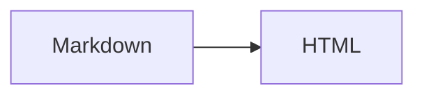

# Markdown 语法参考

Docfuse 支持 CommonMark、GFM 和一组面向技术文档的指令。标准 Markdown 用于正文；Docfuse 指令用于 Tabs、步骤、文件树等结构化内容。编译器负责生成 HTML、ARIA 和交互属性，文档里不需要写 `df-*` 类名。

## 标准 Markdown 与 GFM

| 内容 | 写法 |
|---|---|
| 标题 | `#` 到 `######` |
| 强调 | `**粗体**`、`_斜体_`、`~~删除线~~` |
| 链接与图片 | `[文字](url)`、`` |
| 列表与任务 | `-`、`1.`、`- [x]` |
| 引用 | `> 引用内容` |
| 代码 | `` `inline` `` 和 fenced code block |
| 表格 | GFM 管道表格 |
| 脚注 | `[^name]` 与 `[^name]: 内容` |
| 定义列表 | 一行术语，下一行以 `:` 开始 |

图片 title 会显示为图注。PDF、Word、PowerPoint 或 Excel 链接独占一行时，会显示为文件块。

```markdown
脚注引用。[^source]

[^source]: 脚注内容会集中到页面末尾，并带有返回正文的链接。
```

## 代码块标题与标注

围栏后的 `title`、`filename`、`label` 或 `[文件名]` 会显示为代码块标题。`{2,4-5}` 用于高亮指定行。

````markdown
```ts title="docfuse.config.ts" {2}
import { defineConfig } from 'docfuse'
export default defineConfig({ title: 'Docs' })
```

```ts [routes.ts]
export const routes = []
```
````

需要解释改动或问题行时，在代码注释中使用 Shiki 标注。标注只控制展示，不会出现在复制结果中。

| 标注 | 效果 |
|---|---|
| `[!code ++]`、`[!code --]` | 新增、删除行 |
| `[!code highlight]` | 强调当前行 |
| `[!code focus]` | 聚焦当前行，弱化其他行 |
| `[!code word:名称]` | 强调指定文本 |
| `[!code error]`、`[!code warning]` | 错误、警告行 |

````markdown
```ts
const oldName = 'docs' // [!code --]
const newName = 'docfuse' // [!code ++]
const result = buildSite(config) // [!code focus]
const output = resolveOutput(config) // [!code word:resolveOutput]
throw new Error('Invalid config') // [!code error]
console.warn('Missing description') // [!code warning]
```
````

## 提示块

`info`、`tip`、`warning` 和 `danger` 使用容器指令。标题可以省略。

```markdown
:::tip[提交前检查]
运行类型检查和生产构建。
:::
```

也可以写成 `:::tip 提交前检查`。Docfuse 会在解析前把它转换成相同结构。

## Tabs 与代码组

Tabs 只能直接包含 `tab`。标签未填写时使用本地化的默认名称。

```markdown
::::tabs[安装方式]
:::tab[pnpm]
运行 `pnpm add -D docfuse`。
:::
:::tab[npm]
运行 `npm install --save-dev docfuse`。
:::
::::
```

代码组只能直接包含 fenced code block。`title` 或 `filename` 用作选项卡名称。

````markdown
:::code-group[包管理器]
```bash title="pnpm"
pnpm add -D docfuse
```
```bash title="npm"
npm install --save-dev docfuse
```
:::
````

## 步骤与终端

Steps 只能直接包含 `step`：

```markdown
::::steps[发布流程]
:::step[构建]
运行 `pnpm build`。
:::
:::step[发布]
上传 `.docfuse/dist`。
:::
::::
```

终端输出使用 `terminal` 代码围栏，可通过 `title` 设置标题：

````markdown
```terminal title="Build"
$ pnpm build
✓ Built 42 pages
```
````

## 文件树

`file-tree` 必须包含 Markdown 列表。以 `/` 结尾的条目显示为目录。

```markdown
:::file-tree
- docs/
  - guide/
    - index.md
- docfuse.config.ts
:::
```

## 卡片

`card-grid` 只能直接包含 `card`。每张卡片必须设置 `href`。

```markdown
::::card-grid
:::card[快速开始]{href="/guide/"}
安装并生成第一个站点。
:::
:::card[配置参考]{href="/reference/configuration/"}
查询所有配置项。
:::
::::
```

## API

`api` 必须同时设置 `method` 和 `path`。`response` 只能作为它的直接子项，并且需要状态标签。

```markdown
::::api{method="GET" path="/api/docs/:slug"}
| 参数 | 类型 |
|---|---|
| `slug` | :badge[string] |

:::response[200]
`{ "title": "Docfuse" }`
:::
::::
```

## 行内与辅助内容

```markdown
:::aside[实现说明]
这里放不应打断正文的补充信息。
:::

状态：:badge[Beta]{tone="accent"}

命令：:copy[pnpm add @docfuse/markdown]
```

Badge 的 `tone` 可以是 `accent`、`success`、`warning` 或 `danger`。`:copy` 必须包含可复制文本。

## 图片画廊

Gallery 的每个条目必须单独成段，并且只包含一张 Markdown 图片；图片 title 用作图注。

```markdown
:::gallery[界面截图]


:::
```

## 折叠内容

`details` 的标签会生成原生 `<summary>`，内部可以继续使用 Markdown。`open` 表示默认展开。

```markdown
:::details[部署检查]{open}
- 检查站内链接。
- 运行生产构建。
:::
```

## 音频、视频与嵌入页面

媒体使用叶子指令，不需要手写 HTML。三种指令都要求 `src` 和可访问标签。

```markdown
::video[产品演示]{src="/media/demo.mp4" poster="/media/poster.jpg" preload="metadata"}

::audio[版本说明]{src="/media/release.mp3" preload="none"}

::embed[快速开始]{src="/guide/" allowfullscreen}
```

| 指令 | 可选属性 | 默认值 |
|---|---|---|
| `video` | `poster`、`preload` | `preload="metadata"` |
| `audio` | `preload` | `preload="none"` |
| `embed` | `loading`、`sandbox`、`allow`、`referrerpolicy`、`allowfullscreen` | `loading="lazy"`、空 `sandbox`、`referrerpolicy="no-referrer"` |

`src` 和 `poster` 只接受相对地址、HTTP 或 HTTPS。`preload` 只能是 `none`、`metadata` 或 `auto`；`loading` 只能是 `lazy` 或 `eager`。需要放宽 iframe 权限时，应显式设置最小的 `sandbox` 和 `allow` 权限。

## 插件语法

数学、Mermaid、PlantUML、Graphviz 和 D2 由[官方插件](/guide/site/plugins/)启用。只有配置了对应插件，语法才会转换并加载所需资源。

````markdown


行内公式 $E = mc^2$。
````

## HTML 与错误检查

原生 HTML 只适合作为可信内容的逃生口。站点可以通过 `markdown.html` 选择 `trusted`、`sanitize` 或 `strip`；独立使用 `<Markdown>` 时默认值是 `strip`。

Docfuse 会严格检查指令名称、形态、必填属性和嵌套关系。无效指令会中止渲染，`docfuse check` 会同时给出文件和源码位置。自定义插件必须通过 `directiveNames` 声明自己拥有的指令；未声明的名称会按拼写错误处理。

需要逐项查看渲染效果时，打开 [Playground](/markdown/playground/)。
